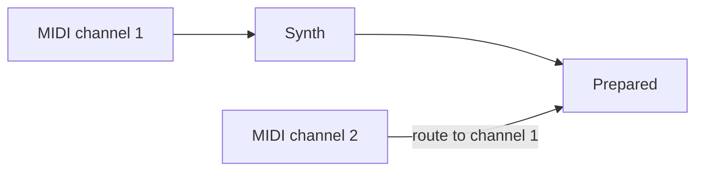

# Prepared

*Prepared* is a *Max for Live* (*M4L*) device for applying string multiphonics and flageolet tones (harmonics) to any pitched sound. *Prepared* was developed as part of my master's thesis at KTH Royal Institute of Technology.

## Prerequisites

- Ableton Live Suite
or
- Max/MSP

## Configuration

The *Prepared M4L* requires both audio and MIDI pitch to work properly. The MIDI pitch should be the pitch of the imported audio. The proper routing is the following

both channels receiving the same MIDI input.
